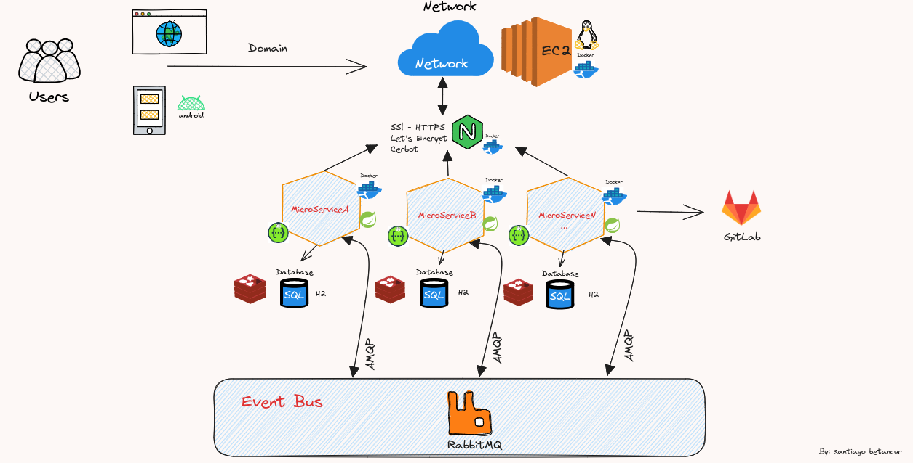

# servicio-cuenta-cliente y servicio-cuenta-movimiento-banco

Microservicio de Clientes, cuentas y movimiento asincrónica

# Definicion de la Arquitectura principal para comunicación de Microservicios por Eventos

Para iniciar estos pasos tener las dos imágenes docker:

### Url Docker
- docker pull santbetv/microservice-docker-serviciocliente:0.0.2-SNAPSHOT
- docker pull santbetv/microservice-docker-serviciocuentamovimiento:0.0.2-SNAPSHOT

### Tambien se puede probar en un ambiente local desde:

### Url GitHub
- https://github.com/santbetv/servicio-cliente-banco.git
- https://github.com/santbetv/servicio-cuenta-movimiento-banco.git

El proyecto corre sobre un db H2 para probar más rápido, pero también se adjunta
SQL para probar en db postgreSQL.

### Postman

Archivo Postman que permite testear las funcionalidades.

### Url swagger

Url de servicios para validar desde swagger funcionalidades más rápidas.

- http://localhost:8089/api/swagger-ui/index.html
- http://localhost:8090/api/swagger-ui/index.html

# Conectar con rabbitMQ manejando colas, para funcionar con clientes, cuentas y movimientos.

## Tener descargado rabbitMQ con: 

### latest RabbitMQ 3.12
- docker run -it --rm --name rabbitmq -p 5672:5672 -p 15672:15672 rabbitmq:3.12-management

## Crear colas
- my_queue_cliente
- my_queue_cuenta

## Probar con docker-compose para ejecución

docker-compose -f docker-compose-dev.yml up -d --force-recreate

## Probar con comandos docker

## Realizar el pull de este micro cliente en la versión 0.0.2-SNAPSHOT:

- docker pull santbetv/microservice-docker-serviciocliente:0.0.2-SNAPSHOT

## Después ejecutar con la ip del rabbitmq docker:

- docker run --network bridge -d --name serviciocliente -p 8089:8089 --env IP_RABBIT=172.17.0.2 santbetv/microservice-docker-serviciocliente:0.0.2-SNAPSHOT

## Realizar el pull de este micro cuenta , movimientos en la versión 0.0.2-SNAPSHOT:

- docker pull santbetv/microservice-docker-serviciocuentamovimiento:0.0.2-SNAPSHOT

## Después ejecutar con la ip del rabbitmq docker y cliente docker:

- docker run -d --network bridge --name serviciocuenta -p 8090:8090 -e IP_RABBIT=172.17.0.2 -e IP_CLIENTE=http://172.17.0.3:8089/api santbetv/microservice-docker-serviciocuentamovimiento:0.0.2-SNAPSHOT

